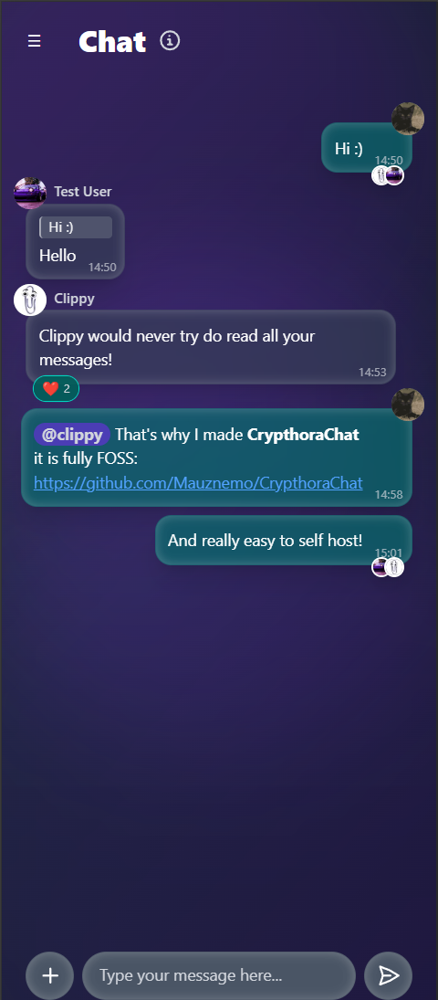
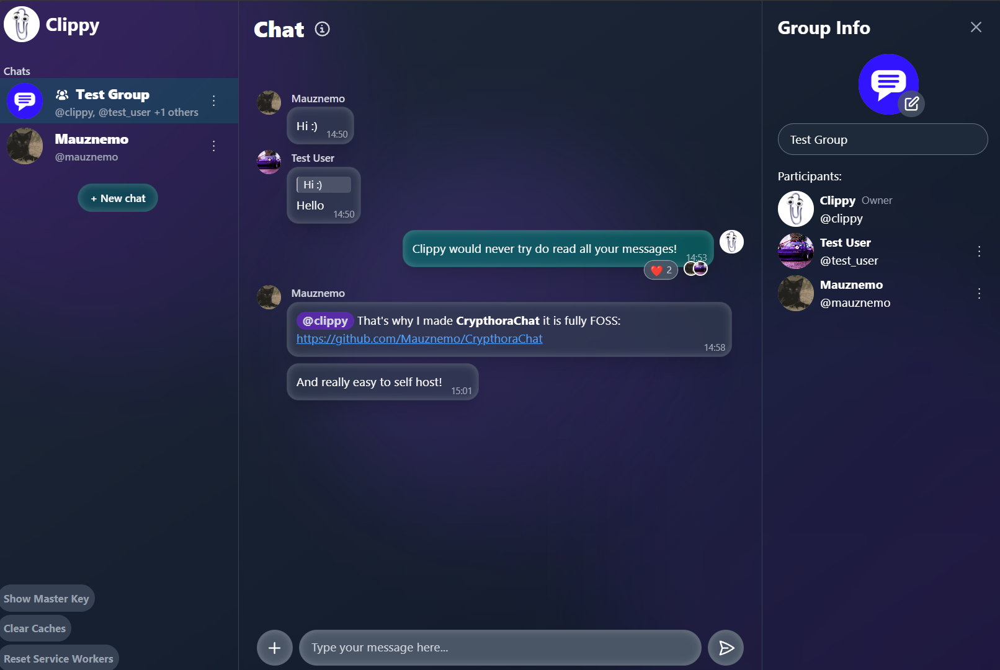

# CrypthoraChat
CrypthoraChat is an open-source, self-hostable, cross-platform E2EE chat app that gives you full control over your own messages.
It can be used as an PWA (Progressive Web App) or on Android with a [wrapper app](https://github.com/Mauznemo/CrypthoraChatWrapper)
CrypthoraChat is meant for family and friends, if you want to chat with multiple people on different servers, the Android wrapper will support easy switching.

>[!CAUTION]
>**Disclaimer:** This project is currently in the development phase, so it my still contain some bugs and is not fully done yet.

  

    
  

  

    
  

## Features
### Current
- User registration/login (with admin dashboard to add allowed usernames)
- Realtime chat with editing, deleting, message reactions, replying and basic markdown support in groups or dms
- Message read receipts
- Push notifications even if the app is closed*
- Verifying others with an emoji sequence
- Multi device support without re-verifying (with a master key)
- Manual chat key rotation

*If the PWA is installed directly, Android devices will go into a deep idle mode after 30 min of inactivity and notifications will stop going through until the phone is unlocked again. You need to use the wrapper app to always get notifications. IOS might have a similar problem, but this is not as easy to fix.

### Planned
- Sticker picker and creator
- File upload (backend is already done)
- Gif picker
- Add localization (German) 
- Customizable colors and background
- Option to disable blur effects for old low end devices
- Automatic chat key rotation
- More markdown support
- Voice Messages
- Session view to log out other devices
- Some other small things

## About
### Why I made this
If you are reading this you probably heard of the EUs plans to scan every message, even in E2EE apps, client side (Chat Control) and I like many others am not a big fan of that.
At first I tied [matrix](https://matrix.org/) with Element X, but it is a bit complex to use in some areas (especially for some people in my family), behaves a bit weird sometimes, push notifications where unreliable sometimes, but mainly it is missing some features my friends and I use a lot (like stickers and an in app gif picker).
I was also scared that if the law goes though the matrix client apps might get taken down (especially a problem for IOS users), this problem does not exist with my PWA approach since it is just a website on your domain or even just local network.

### What's Encrypted
- Messages: All text messages, images, reactions and files sent between users are end-to-end encrypted
- User profile pictures and group images are encrypted server-side (Not E2EE) for storage on disk
- Usernames, group names, timestamps, system messages (like @user left group) and in which group which user is, is stored un-encrypted

### Trust Model for Group Chats
When a group is created, a unique, key is generated. This key is used to encrypt everything sent within the group. The process for adding a new user works as follows:

- **Group Owner Verifies New Member:** The group owner must manually verify the new user. This is done by comparing a unique emoji sequence displayed on both the owner's and the new user's screens. This "out-of-band" verification ensures that the chat key is shared to the actual member added.

- **Implicit Trust for Other Members:** Once the group owner has verified the new member, the new user's device receives the group's encrypted key from the owner. The other members of the group do not need to individually verify the new user. They implicitly trust that the group owner has performed the necessary verification.

- **Group Key Management:** If a user is removed from the group, the group key is automatically rotated (**NOTE:** this is planned at the moment only manual rotation is possible).

### Technical Implementation Details

> [!WARNING]
> I'm not a cryptography/security expert
> If you are one please feel free to have a look at the crypto code (at `src/lib/crypto`) and create an issue if you find anything!

- **Key Exchange:** CrypthoraChat uses RSA-OAEP with a 2048-bit modulus to perform a secure key exchange. This asymmetric key pair allows users to encrypt a shared chat key for a new conversation. The verification of the public key when starting a chat with someone for the first time ensures protection against "man-in-the-middle" attacks

- **Symmetric Encryption:** All messages, files, and chat contents are encrypted using AES-GCM (256-bit).

- **Key Rotation & Forward Secrecy:** The application automatically rotates chat keys (**NOTE:** this is planned at the moment only manual rotation is possible) to ensure forward secrecy. When a new member is added to a group, they only receive the new key, preventing them from decrypting past messages. The new key is distributed securely the same way as mentioned before.

- **On-Device Key Storage:** To support multi-device setups, a 16-byte seed (128-bit entropy) is stored in the browser's IndexedDB. This seed is used to derive a master key, which then encrypts all chat keys before they are stored in the database.

## Getting started
CrypthoraChat comes with a `docker-compose.yaml` file meaning you can simply deploy it almost everywhere or test locally.

### Running locally
1. Create a `.env` file and copy the content from `.env.example` and fill it all out
2. Run `docker-compose up -d --build` you can now access it at [http://localhost:3000/](http://localhost:3000/)

### Coolify guide
1. Select a project, click on new resource and select "Public Repository"
2. Under "Build Pack" select "Docker Compose", click "Continue" and wait a bit for it to load everything.
3. Now you can set the domain for your chat app and for ntfy (this is used for more reliable push notification in the android wrapper app), click "Save"
4. Go to the "Environment variables" tab and set both URLs again there, also set a password for the postgres database
5. Now set your VAPID data (this is needed for push notification everywhere else), you can use [this](https://www.attheminute.com/vapid-key-generator) website to generate the keys, you also need to to input any email address. (It is used for a critical administrative and security function, allowing the push service to communicate with you, the server operator, if problems arise)
6. Set `PROFILE_PIC_KEY` to a random 32 byte value, you can run this to generate one `node -e "console.log(require('crypto').randomBytes(32).toString('base64'))"`
7. Now hit "Deploy"
8. When its done you can click on "Links" and open the chat app, the first user registered will be the server admin that manges the allowed user names

## Tech stack
- [SvelteKit 5](https://svelte.dev/) (experimental [Remote Functions](https://svelte.dev/docs/kit/remote-functions) are enabled)
- [Tailwind](https://tailwindcss.com/)
- [Prisma](https://www.prisma.io/)
- [Postgres](https://www.postgresql.org/)

## Developer Setup
If you wan to contribute or make changes this is how to set everything up.
1. Set up the Postgres database for development, this depends on your operating system (on linux you can just install it) on windows it is easies to use [Docker Desktop](https://www.docker.com/products/docker-desktop/), after installing it you can run `docker exec -it sveltekit-postgres psql -U dev -d sveltekit_dev` to create the db container.
2. Copy the `.env.example` file and rename it to `.env`, now fill out everything needed. 
3. Run `npm install`
4. Run `npx prisma migrate dev` and `npx prisma generate`
5. Now you can start the local dev server with `npm run dev`